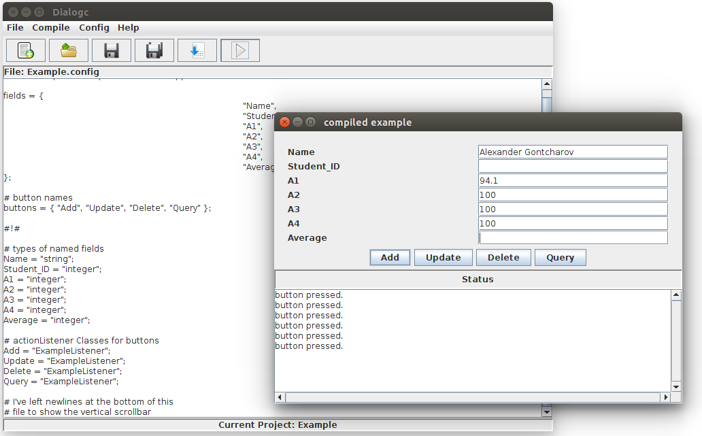

# Dialog System Compiler
> A simplified JAVA GUI language compiler



Dialog System Compiler (Dialogc) is an IDE compiler which takes a simplified pre-determined language and spits out an executable Java GUI code which can be run directly in the IDE or as a stand alone program. Dialogc comes with 2 compile mode: IDE Compiler and Lex/Yacc Compiler. The IDE Compiler is the in built default compiler for Dialogc which is based on a finite state machine implemented in C. On the other hand, the Lex/Yacc Compiler is based on tokens provided by the Lexixal Analyzer Genetaor and the grammar rules defined in Yacc (Yet Another Compiler-Compiler). In addition, the Lex/Yacc Compiler can be run as a stand alone program (yadc) also spitting out an executable Java GUI code.

The GUI for Dialogc is fully implemented in Java, under the Swing library and is connected straight to the IDE Compiler through the Java Native Interface (JNI). Furthermore, a bash script is provided which will guide a user through the installation of the Dialog System Compiler and install in a directory of their choice. The newly compile Java GUI code also has hooks attached for action listeners which __need__ to be provided by the user after the initial compile as a class on its own.

## .Config File

| Basic Syntax |                             Description                             |
|--------------|---------------------------------------------------------------------|
| ;            | Statement terminator                                                |
| #            | Comment character                                                   |
| =            | Assignment Operator                                                 |
| #!#          | Used as separator to parse field types and button action listeners  |

| Keywords |                              Syntax                              |                 Example                 |
|----------|------------------------------------------------------------------|-----------------------------------------|
| title    | Must be enclosed in quotation marks                              | title = "my Application";               |
| fields   | Represented as a set, each element enclosed in quotation marks   | fields = {"Name", "ID", "Age"};         |
| buttons  | Represented as a set, each element enclosed in quotation marks   | buttons = {"Add", "Update", "Delete"};  |

If fields or buttons are given values then their type and action listeners must be specified respectively.

```
#!#

# Types of fields
Name = "String";
ID = "Integer";
ID = "Integer";

# Action Listerner
Add = "AddListener";
Update = "UpdateListener";
Delete = "DeleteListener";
```

_An example .config file is provided in the config_files folder along with an action listener_

## Installation

Linux (git):

```sh
git clone https://github.com/AGontcharov/Dialog-System-Compiler.git
cd Dialog-System-Compiler

From here you need to open the Makefile in a text editor
Replace the macros JPATH3 and JPATH4 with the location of <jni.h> on your system
save the Makefile
```

Linux (Script):

```sh
git clone https://github.com/AGontcharov/Dialog-System-Compiler.git
cd Dialog-System-Compiler
rm -rf !(Script)
cd Script
chmod u+x install_dialogc.sh
./install_dialogc.sh

Follow the instructions on the screen
```

OS X:
```
Not yet available
```

Windows:

```sh
Not yet available
```
## Running

Linux (Dialogc):

```sh
cd Dialog-SystemCompiler
make
```

Linux (yadc):

```sh
cd Dialog-system-Compiler
cd yadc
./yadc [.config file path] [project name] [output directory (empty if cwd)]
```

## Usage example

## Meta

Alexander Gontcharov – alexander.goncharov@gmail.com

[https://github.com/AGontcharov/](https://github.com/AGontcharov/)
